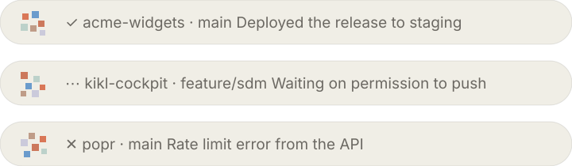

<div align="center">


# POPR

**Clickable macOS banners for Claude Code, drawn by POPR itself.**

A session finishes, wants a permission, or hits an error. You hear it, you see it,
and one click puts you back in the window it came from.

[](https://github.com/tdries/td-claude-plugin-popr/actions/workflows/ci.yml)
[](LICENSE)
[](#requirements)
[](#install)



<sub>The three banner types. Each carries its own project's confetti mark, generated from the project name.</sub>

</div>

---

## Why

You start something long in Claude Code, switch to another window, and lose the
thread. Either you babysit the session or you forget it for twenty minutes. POPR
is the smallest thing that fixes that: a sound, a banner that tells you *which*
project and *what* happened, and a click that takes you straight back.

Run five sessions at once and you get five banners, one per session, each
clicking through to its own window.

## What you get

| | |
|---|---|
| **Done** | Project, branch, and a seven word status |
| **Needs you** | Permission prompts, MCP input forms, background agents waiting |
| **Error** | The turn stopped on an API error, with the error type |
| **One click back** | Reopens the exact editor window that session belongs to |
| **Self cleaning** | A session's banner vanishes the moment you prompt it again |
| **Confetti DNA** | Every project gets its own mark and its own burst, from its name |
| **Its own sounds** | Three low swells sharing one timbre, not a system chime |
| **Nothing leaves** | No network calls, no telemetry. Ever. |

## Install

Pick **one**. Installing two ways would fire every notification twice, so POPR
detects that and refuses the second rather than let it happen.

<details open>
<summary><b>Claude Code plugin</b> — no terminal, recommended</summary>
<br>

```
/plugin marketplace add tdries/td-claude-plugin-popr
/plugin install popr@popr
```

Settings live in Claude Code's own plugin settings screen.

</details>

<details>
<summary><b>Homebrew</b></summary>
<br>

```bash
brew install tdries/tap/popr && popr install
```

</details>

<details>
<summary><b>curl</b></summary>
<br>

```bash
curl -fsSL https://raw.githubusercontent.com/tdries/td-claude-plugin-popr/main/install.sh | sh
```

</details>

<details>
<summary><b>npx</b></summary>
<br>

```bash
npx popr-cli install
```

</details>

<details>
<summary><b>Double click</b></summary>
<br>

Download the zip from [Releases](https://github.com/tdries/td-claude-plugin-popr/releases),
unzip, then **right click** `Install POPR.command` → **Open**.

The right click is not optional. A file downloaded through a browser is
quarantined by macOS, and POPR has no Developer ID certificate to clear that with,
so a plain double click gives you a warning and no way past. Right click → Open
gives you an **Open** button. Once, ever.

</details>

### Then, once

1. Reload your editor window (`Developer: Reload Window`), or `/reload-plugins` in a session.
2. `popr doctor`, then `popr test` or `/popr:test`.

No notification permission to grant and no System Settings to visit: POPR draws
its own banners, so macOS's notification system is not involved at all.

## Configure

```bash
popr config     # interactive, writes ~/.config/popr/config.json
```

| Setting | Env var | Default | |
|---|---|---|---|
| Done sound | `POPR_SOUND_DONE` | POPR's hum | a macOS sound name, an audio file path, or `none` |
| Needs input sound | `POPR_SOUND_ATTENTION` | POPR's hum | |
| Error sound | `POPR_SOUND_ERROR` | POPR's hum | |
| Volume | `POPR_VOLUME` | `1` | 0 to 1 |
| Say the project name | `POPR_SPEAK` | `false` | useful when you run many sessions |
| Quiet when the editor is in front | `POPR_QUIET_WHEN_FOCUSED` | `false` | |
| Force the target app | `POPR_APP` | autodetect | e.g. `Cursor` |
| Status length | `POPR_SUMMARY_WORDS` | `7` | words of status on the banner |
| Confetti | `POPR_CONFETTI` | `true` | the burst out of the banner's mark |
| Confetti reach | `POPR_CONFETTI_SIZE` | `90` | pixels |
| Banner style | `POPR_BANNER_STYLE` | `pill` | `pill` (ivory) or `glass` (blurred dark) |
| Banner mark | `POPR_BANNER_ICON` | the project's own | a PNG to use instead |
| Font | `POPR_FONT` | system | a family name, e.g. `Styrene A` |
| Draw our own banners | `POPR_BANNER` | `true` | `false` falls back to macOS notifications |
| Also post natively | `POPR_NATIVE` | `false` | adds a macOS notification for the history |

Built-in macOS sounds: Basso, Blow, Bottle, Frog, Funk, Glass, Hero, Morse, Ping,
Pop, Purr, Sosumi, Submarine, Tink.

Environment variables beat plugin options, which beat the config file, which beats
the defaults. Plugin users can set all of it in Claude Code's plugin settings.

## Commands

```bash
popr doctor        # dependencies, detected app, click action, hook and bundle status
popr test          # fire a test banner
popr config        # interactive settings
popr install       # register the hooks   (--quiet for scripts, --force to override)
popr uninstall     # remove them, and close any open banners
```

## How it works

Four hooks call one bash script.

| Hook | Mode | |
|---|---|---|
| `Stop` | `stop` | `✓` banner, plus the confetti |
| `Notification` | `attention` | `⋯` banner with Claude's own message |
| `StopFailure` | `error` | `✕` banner with the error type |
| `UserPromptSubmit` | `clear` | removes that session's banner |

**Finding your window.** POPR walks up the process tree until it hits the `.app`
bundle that launched Claude: VS Code, Cursor, Windsurf, VSCodium, Kiro, Trae,
Claude Desktop, or a terminal. For an editor the click runs
`open -a "<app>" "<project folder>"`, which raises the window that already has
that folder open. For anything else it activates the app.

**Never in your way.** All the slow work happens in a detached subshell and every
code path exits 0, so a hook cannot slow down or break your turn.

**POPR draws its own banners.** macOS gives no control over a notification
banner. The layout is fixed. The icon comes from the app bundle and cannot be
emptied — hand it a blank one and it draws a white square, which we tested on a
bundle identifier macOS had never seen, so no cache was involved. And nothing
inside one will animate: an animated GIF handed over as the content image is
accepted, delivered, and then shown as its first frame and nothing else. No other
tool avoids any of this, because they all post through the same
`UNUserNotificationCenter` and the banner is drawn by the OS.

So POPR stops asking. It draws a non-activating panel: a 30px ivory pill, one
line, above everything, click-through to nothing but itself, that stays until you
click it. A JXA script run by `osascript`, which ships with macOS, so it adds no
dependency and needs no Xcode.

**Confetti DNA.** Every project gets its own mark and its own burst, both seeded
from the project name with FNV-1a. `acme-widgets` always throws the same pieces
the same way; `kikl-cockpit` throws different ones. Every mark carries all six
brand colours exactly once and every burst all four explosion colours twice, so
the arrangement varies but the weight never does. Chips are stratified across
quadrants and then centred on their centre of mass, because a mark centred on its
bounding box still reads as high when the ink sits in the top half.

The burst comes **out of the mark**. That is only possible because we draw the
banner: macOS never reveals where it put its own, so there was nothing to aim at.

**Its own sounds.** Three swells sharing one timbre, synthesized from the Python
standard library: G major and settled when a turn lands, rising and unresolved
when Claude needs you, minor and falling when it broke. macOS's fourteen system
sounds are all chimes and alerts.

**Never in your way.** All the slow work happens detached and every code path
exits 0, so a hook cannot slow down or break your turn.

## Requirements

macOS 13 or later, [Claude Code](https://claude.com/claude-code), and `jq`, which
every install path fetches for you through Homebrew.

`terminal-notifier` is **optional**. POPR draws its own banners, so it is only
needed if you turn on `native` to also post macOS notifications.

## Limits

Honest ones, so nobody files them twice:

- **No Notification Center history.** POPR's banners are its own windows, so nothing lands in Notification Center and nothing survives being dismissed. `POPR_NATIVE=true` posts a macOS notification alongside if you want the history back.
- **Focus and Do Not Disturb are not consulted.** Same reason: POPR is not going through the notification system, so the system's silencing rules do not apply to it.
- **The status is seven words**, taken from the first sentence of Claude's reply. It is a status, not a summary Claude wrote for the purpose.
- **Each open banner costs about 34 MB** while it waits for your click, and no measurable CPU. There is at most one per session.
- **The banner follows the pointer.** On several screens it appears on the one your mouse is on, not whichever macOS calls main.
- **The click focuses a window, not a tab.** With several sessions in one folder, the title tells you the project and the preview tells you the conversation.
- **`.code-workspace` spanning several folders** may open the project folder in a separate window.
- **macOS only**, by design.

Log: `~/Library/Logs/popr.log`

## Develop

```bash
tests/test.sh                                                   # 25 assertions, posts nothing
shellcheck bin/popr install.sh tests/test.sh "packaging/Install POPR.command"
python3 assets/make_logo.py --icns --gif                        # regenerate every logo form
```

Tests run under `POPR_DRY_RUN=1`, which prints what would be posted instead of
posting it. See [CONTRIBUTING.md](CONTRIBUTING.md).

[docs/DESIGN.md](docs/DESIGN.md) is the reasoning: why there is no `.app` to
download, what macOS refuses to allow, and what is deliberately out of scope.

## Project

[Contributing](CONTRIBUTING.md) ·
[Security](SECURITY.md) ·
[Code of conduct](CODE_OF_CONDUCT.md) ·
[Changelog](CHANGELOG.md) ·
[Design](docs/DESIGN.md)

POPR is a rename and repackage of Butlr, the same tool before it was fit to hand
to anyone else.

## License

MIT © [Tim Dries](https://github.com/tdries)
