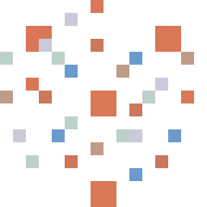

<div align="center">



# POPR

**Clickable macOS notifications for Claude Code.**

When a session finishes, wants a permission, or hits an error, you hear it and see it.
Click the banner and the window that session lives in comes to the front.

[](https://github.com/tdries/td-claude-plugin-popr/actions/workflows/ci.yml)
[](LICENSE)


</div>

---

## What you get

| | |
|---|---|
| ✅ **Done** | A sound and a banner carrying the project, the git branch, and a preview of Claude's last answer |
| ⏳ **Needs you** | Permission prompts, MCP input forms, background agents waiting on you |
| ⚠️ **Error** | The turn stopped on an API error, with the error type |
| 🖱 **One click back** | The banner reopens the exact editor window that session belongs to |
| 🧹 **Self cleaning** | A session's banner disappears the moment you send your next prompt there |
| 📚 **One banner per session** | Five sessions running means at most five banners, never a pile |

## Install

Pick **one**. Installing two ways gives you two banners for every event, and POPR
will refuse the second one rather than let that happen.

<details open>
<summary><b>Claude Code plugin</b> — no terminal, recommended</summary>

In any Claude Code session:

```
/plugin marketplace add tdries/td-claude-plugin-popr
/plugin install popr@popr
```

Settings live in Claude Code's own plugin settings screen.
</details>

<details>
<summary><b>Homebrew</b></summary>

```bash
brew install tdries/tap/popr && popr install
```
</details>

<details>
<summary><b>curl</b></summary>

```bash
curl -fsSL https://raw.githubusercontent.com/tdries/td-claude-plugin-popr/main/install.sh | sh
```
</details>

<details>
<summary><b>npx</b></summary>

```bash
npx popr-cli install
```
</details>

<details>
<summary><b>Double click</b></summary>

Download the zip from [Releases](https://github.com/tdries/td-claude-plugin-popr/releases),
unzip it, then **right click** `Install POPR.command` → **Open**.

The right click is not optional. POPR is not code signed (that needs a paid Apple
Developer account), so double clicking it directly gets you a Gatekeeper warning
with no way past. Right click → Open gives you an **Open** button. You only do
this once.
</details>

After any of them:

1. **System Settings › Notifications › terminal-notifier** — Allow notifications **on**, banner style **Persistent**. Check no Focus mode is silencing it.
2. Reload your editor window (`Developer: Reload Window`), or `/reload-plugins` in a session.
3. `popr doctor` or `/popr:test` to check it end to end.

## Configure

Three ways, first one wins:

```bash
popr config          # interactive, writes ~/.config/popr/config.json
```

| Setting | Env var | Default | |
|---|---|---|---|
| Done sound | `POPR_SOUND_DONE` | `Glass` | any macOS sound name, an audio file path, or `none` |
| Needs input sound | `POPR_SOUND_ATTENTION` | `Ping` | |
| Error sound | `POPR_SOUND_ERROR` | `Basso` | |
| Volume | `POPR_VOLUME` | `1` | 0 to 1 |
| Say the project name | `POPR_SPEAK` | `false` | useful with many sessions |
| Quiet when the editor is in front | `POPR_QUIET_WHEN_FOCUSED` | `false` | |
| Force the target app | `POPR_APP` | autodetect | e.g. `Cursor` |
| Banner picture | `POPR_ICON` | POPR confetti | a PNG path, `app` for the editor icon, `none` to hide |

Sound names: Basso, Blow, Bottle, Frog, Funk, Glass, Hero, Morse, Ping, Pop,
Purr, Sosumi, Submarine, Tink.

Plugin users can set the same things in Claude Code's plugin settings. Environment
variables beat plugin options, which beat the config file, which beats the defaults.

## How it works

Four hooks call one bash script.

| Hook | Mode | What happens |
|---|---|---|
| `Stop` | `stop` | ✅ banner with a preview of the answer |
| `Notification` | `attention` | ⏳ banner with Claude's own message |
| `StopFailure` | `error` | ⚠️ banner with the error type |
| `UserPromptSubmit` | `clear` | removes that session's stale banner |

POPR walks up the process tree until it finds the `.app` bundle that launched
Claude: VS Code, Cursor, Windsurf, VSCodium, Kiro, Trae, Claude Desktop, a
terminal. For editors the click runs `open -a "<app>" "<project folder>"`, which
raises the window that already has that folder open. For everything else it
activates the app.

All the slow work happens in a detached subshell, and every code path exits 0, so
a hook can never slow down or break your turn.

## Commands

```bash
popr doctor        # dependencies, detected app, click action, hook status
popr test          # fire a test banner
popr config        # interactive settings
popr install       # register the hooks
popr uninstall     # remove them
```

## Limits

- Notifications are posted through `terminal-notifier`, so macOS shows them under **that** name and permission row, not POPR's. Fixing it needs a signed app bundle, which needs a paid Apple Developer account.
- The click focuses the right editor **window**, not a specific Claude tab. With several sessions in one folder, the title tells you the project and the preview tells you the conversation.
- With a `.code-workspace` spanning several folders, the click may open the project folder in a separate window.
- macOS only, by design.

Log: `~/Library/Logs/popr.log`

## Develop

```bash
tests/test.sh                    # 21 assertions, fires no real notifications
python3 assets/make_logo.py      # regenerate the logo at every size
shellcheck bin/popr install.sh   # lint
```

Design and the reasoning behind it: [docs/DESIGN.md](docs/DESIGN.md).

POPR is a rename and repackage of Butlr, the same tool before it was fit to hand
to anyone else.

## License

MIT © Tim Dries
